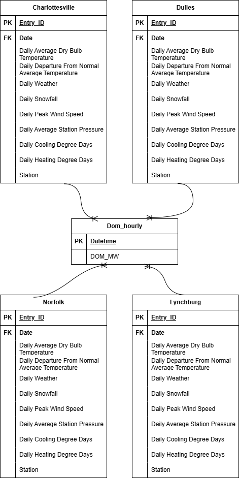

# DS4320 Project 1: Predicting Energy Usage

### Executive Summary
This repository contains background information, metadata, data files, and Python code for a DS4320 Project 1 about the accuracy of different machine learning models for forecasting energy demands based on weather data. The background information explains why this topic is relevant today. The metadata provides a data dictionary, bias and uncertainty identificaion, and other rationales. The cleaned data files are included in the `data` folder, along with Python code that runs through the analysis and visualization of the solution. 

| Spec | Value |
| :--- | :--- |
| Name | Iliana Vasslides | 
| NetID | fbv2sc | 
| DOI | [doi](https://doi.org/10.5281/zenodo.19324395) |
| Press Release | [link to Press Release](https://github.com/ivasslides/ds4320-project-1/blob/main/press_release.md) | 
| Data | [link to data folder](https://myuva-my.sharepoint.com/:f:/g/personal/fbv2sc_virginia_edu/IgD0_dw8bOXbQqtcXuFmWMcQAbQHJMFY-ToaHPTsxSS_jvY?e=cAJDgh)  | 
| Pipeline | [link to pipeline files](https://github.com/ivasslides/ds4320-project-1/tree/main/pipelines) | 
| License | [link to license](https://github.com/ivasslides/ds4320-project-1/tree/main?tab=MIT-1-ov-file) | 

## Problem Definition
#### General Problem 
* Forecasting energy demands 
#### Specific Problem
* How accurately can machine learning models forecast electricity demand during extreme temperature events compared to during normal weather conditions in Virginia? 

#### Rationale 
The purpose of this refinement is to look more closely at energy prediction when the weather pattern strays from normal, and therefore the energy demand might stray from normal as well. During extreme temperature events, such as heat waves and cold snaps, citizens tend to use more electricity than usual to keep their homes at the desired temperature. This increased use of heating or air-conditioning can cause sudden spikes in electricity demand that are more difficult for forecasting models to predict accurately. By focusing specifically on these extreme conditions, the analysis can evaluate whether traditional prediction models still perform well when demand patterns become irregular. Understanding these differences can help improve forecasting methods and ensure that energy providers are better prepared for periods of unusually high demand.

#### Motivation
Electricity companies want to be as prepared as possible to best serve their clients. With this in mind, it would be beneficial if they were able to accurately predict when large changes in energy demands will occur. Accurate forecasts allow utilities to plan how much electricity needs to be generated and distributed across the grid at any given time. If demand is underestimated during extreme weather events, it can strain the power grid and potentially lead to outages or emergency measures. On the other hand, overestimating demand can result in unnecessary costs from generating excess electricity. By improving predictions of demand during extreme temperature events, energy providers can make more informed operational decisions and maintain a more reliable and efficient power system.

#### Press Release 
[Let's hope energy can keep up with Mother Nature's big changes](https://github.com/ivasslides/ds4320-project-1/blob/main/press_release.md) 

## Domain Exposition 
#### Terminology 
| Term | Definition |
| :--- | :--- | 
| *Daily Average Dry Bulb Temperature* | the average temperature of the air measured by a therometer that is shielded for radiation and moisture|
| *Electricity demand* | the total amount of electrical power being used at a specific moment, reflecting the instantaneous load on the power grid | 
| *Extreme weather event* | rare weather occurrence that is outside of the range of average weather patterns for a particular location and time of year |
| *Linear regression model* | fundamental supervised machine learning algorithm used to model the relationship between a dependent variable and one or more indepedent variables | 
| *MWH* | megawatt-hour; a unit of energy representing one million watt-hours; used to measure electricity consumption or generation over time| 
| *NOAA* | National Oceanic and Atmospheric Administration; U.S. federal agency that studies and monitors the oceans, atmosphere, and coastal areas to provide critical information to the public | 
| *Random forest model* | ensemble machine learning algorithm that builds multiple decision trees and combines their outputs to improve prediction accuracy| 

#### Project Domain
The main domain that this project lives in is Demand Forecasting Analytics. Demand forecasting analytics focuses on understanding the different factors that influence electricity consumption at certain times. By combining historical electricity consumption data with external variables such as weather conditions, analysts can identify relationships to accurately predict future energy demands. These insights allow energy companies to make informed decisions about generation and distribution. Additionally, anticipating unusual demand patterns is an important aspect of this domain. By analyzing how weather variability affects energy usage, forecasting models can help energy companies better prepare for these scenarios.

#### Background Readings 
[link to OneDrive folder](https://myuva-my.sharepoint.com/:f:/g/personal/fbv2sc_virginia_edu/IgBT-8V3aSw6Ra1ayGtJOW_mAbEVKdL8xiyp1iE4mzLFmzA?e=r1OJln) 

#### Summary of Readings 
| Title | Brief Description | Link to File |
| :--- | :--- | :--- |
|*Allocation of policy resources for energy storage development   considering the Inflation Reduction Act* | This paper touches on the issue surrounding gas emissions from energy storage areas, and how the Inflation Reduction Act   has impacted things. It examines the options for different regions, and the tax and emissions benefits for each. | [link](https://myuva-my.sharepoint.com/:b:/g/personal/fbv2sc_virginia_edu/IQAobMfcg-0YTpssH-BMO19uAcW-IEkpGgbGLEM_FBrCyBg?e=GsZfPE) |
|*Extreme weather events on energy systems* | This paper examines the impacts of extreme weather events on energy systems and their associated infrastructures. It reviews   published studies to find a solution to help energy systems maintain regular operations. | [link](https://myuva-my.sharepoint.com/:b:/g/personal/fbv2sc_virginia_edu/IQAMSpiPuU2sRIKLnHiKZIKfAasXiMpPlPZS9cxc60p2Qc0?e=btj1xF) |
| *How does extreme weather impact energy demand and energy rates* | This article explains why and which weather events have the biggest impact on energy demands and the prices. It also gives  advice to help clients keep costs down. | [link](https://myuva-my.sharepoint.com/:b:/g/personal/fbv2sc_virginia_edu/IQDQYKV7yPiCSLWQR4xDmNX9AY8Qgi98dtROQOk6OTBGtNU?e=ACKCzt) |
| *Keeping the lights on in our neighborhoods during power outages* | This blog dives into recent microgrid projects that have been started in a variety of states to help with electricity demands.   The goal of these projects, funded by the DOE in 2023, is to increase resilience during major events and reduce power outages. | [link](https://myuva-my.sharepoint.com/:b:/g/personal/fbv2sc_virginia_edu/IQD_8rKMuosQTrTh9D7Nf-vIAaFrn93OXRWaAcmbzXBnwKw?e=79zTia) |
| *NOAA Local climatological data datase documentation* | This is the offica documentation from the NOAA local climatological dataset (LCD), where the weather data for this project was requested from. It defines the variables in the dataset and how they are collected. | [link](https://myuva-my.sharepoint.com/:b:/g/personal/fbv2sc_virginia_edu/IQBBpSWIgpgNRqHtKWDpZSDrAX6YE6JG0rFcJOeMhdzvUYs?e=vZ74iX)

## Data Creation 
#### Raw Data Acquistition 
To start the raw data acquisition process, I did some research to find weather data and energy usage data. I found a Kaggle datatset called 'Hourly Energy Consumption' which is a collection of PJM Interconnection LLC data. I chose to only use the DOM_hourly data, which is data from Dominion Virginia Power. Additionally, I found NOAA's Climate Data Online Datasets page to find weather data from any time from any place. I selected the same dates as the DOM_hourly data and chose 4 cities from 4 different areas in Virginia to get a representative view of the energy usage and weather relationship. The cities I chose are Charlottesville (station at Cville Airport), Washington-Dulles airport, Norfolk (station at Norfolk Int. Airport), and Lynchburg (station at Lynchburg Airport). The data was downloaded from each website in a csv format, and then loaded into a duckdb database as tables after each stage of the data loading and data cleaning proccess. 

#### Code Used
| File | Brief Description | Link |
| :--- | :--- | :--- | 
| *1-data-loading.ipynb* | Loads 8 weather csv files and 1 energy csv file, cleans up extra columns, and loads each city's Dataframe and energy dataframe into 5 total parquet files and duckdb tables. | [link](https://github.com/ivasslides/ds4320-project-1/blob/main/pipelines/1-data-loading.ipynb) | 
| *2-data-cleaning.ipynb* | Cleans data tables by removing NaNs and ensuring all are in float format, and adds extreme weather event classification column | [link](https://github.com/ivasslides/ds4320-project-1/blob/main/pipelines/2-data-cleaning.ipynb) | 
| *3-analysis.ipynb* | Merges weather and energy data to create combined_df file, and runs Linear regression and Random forest models on the data to assess performance of accurate prediction of energy usage overall, for normal weather conditions, and for extreme weather conditions. | [link](https://github.com/ivasslides/ds4320-project-1/blob/main/pipelines/3-analysis.ipynb) |
| *4-visualizations.ipynb* | Creates a bar chart showing the performance metrics (RMSE, MAE, R^2) for each model for each scenario, and saves image as png | [link](https://github.com/ivasslides/ds4320-project-1/blob/main/pipelines/4-visualization.ipynb)  
| *pr_chart.ipynb* | Creates line chart to demonstrate the corresponding changes in temperature and energy usage, for Charlottesville specifically, for the Press Release | [link](https://github.com/ivasslides/ds4320-project-1/blob/main/pr_chart.ipynb) | 
| *quant-of-uncertainty.ipynb* | Calculates standard deviation for `DailyAverageDryBulbTemperature` for each season, for each city, and results are highlighted in Metadata/Uncertainty. | [link](https://github.com/ivasslides/ds4320-project-1/blob/main/quant-of-uncertainty.ipynb) | 

#### Bias Identificaton 
There are two main areas of where bias could have been introduced in the data collection process: geographic decisions and data cleaning decisions. The bias from geographic decisions could have stemmed from my personal choices of the stations at the beginning of the data collection process. While I tried to choose stations and areas that were in different geographic areas, to attempt to be fully representative of the state of Virginia, there could easily be some bias still included within that because of how variable weather can be. The bias from data cleaning decisions could have appeared when choosing to drop columns, and even more so when converting many of the columns values to be floats, not strings, and rounding out of the intervals.

#### Bias Mitigation
The bias from geographic decisions can be quantified in analysis by quantifying geographic variability. This would entail measuring differences in temperature and other features across the 4 cities to understand how representative each location is to the mean. The bias from data cleaning decisions can be handled by using imputation instead of dropping all missing values. Ideally, this will help reduce any additional bias from data loss.

#### Rationale 
The data cleaning decisions were made with keeping the analysis straightforward and simple in mind. The last section in data-loading.ipynb drops all rows where `DailyAverageDryBulbTemperature` is NaN, because that signifies that those entries were hourly entries and not daily entries. For this analysis, we are looking at daily patterns and not necessarily as concerned with hourly patterns over the course of 13 years. This might introduce some uncertainty in the analysis because some smaller extreme weather events might have been dropped if they were only marked during hourly measurements. The values for the other daily measurement columns were converted from strings to floats for easier analysis, as wel as consistency throughout the dataset. 

## Metadata
#### Schema
 

#### Data Table 
| Table | Brief Description | Link |
| :--- | :--- | :--- |
| *combined_df* | Dataset of all cleaned weather data from 4 cities merged with energy data for analysis purposes, in parquet format | [link](https://myuva-my.sharepoint.com/:u:/g/personal/fbv2sc_virginia_edu/IQA2ElxHacS5Tp66CDR1bq2ZAT1-BNz2ZhIihX55oXrm0-g?e=6YBbFB)
| *cville_cleaned* | Cleaned dataset of temperature and other weather measurements from Charlottesville, VA from 12/31/2005 - 12/31/2018, in parquet format | [link](https://myuva-my.sharepoint.com/:u:/g/personal/fbv2sc_virginia_edu/IQAd4-g7q3amR4K5oGu8fmHZAXoVvGSsJCgcgltqZbOxmI4?e=DQuxgY) | 
| *DOM_hourly* | Electricity usage measurements, in megawatts, from Dominion Energy from 12/31/2005 - 12/31/2018, in parquet format | [link](https://myuva-my.sharepoint.com/:u:/g/personal/fbv2sc_virginia_edu/IQBzbVHUg3U9TLdTGYGYbP9iAWEk3xl3HkVQ-KwfpbFqSuw?e=YWzys8) |
| *dulles_cleaned* | Cleaned dataset of temperature and other weather measurements from Washington-Dulles Airport, VA from 12/31/2005 - 12/31/2018, in parquet format | [link](https://myuva-my.sharepoint.com/:u:/g/personal/fbv2sc_virginia_edu/IQDmMFJBNizAR68yxU50BPtdASnDwINQaaS6pw4n1bmOqZA?e=zREWIG) | 
| *lynchburg_cleaned* | Cleaned dataset of temperature and other weather measurements from Lynchburg, VA from 12/31/2005 - 12/31/2018, in parquet format | [link](https://myuva-my.sharepoint.com/:u:/g/personal/fbv2sc_virginia_edu/IQA8oU2hJtlKRoM4xiSu2S5JAVsITH-jg0Eh9Q3XArcfwpQ?e=WgV7Vg) | 
| *model_results* | Dataframe of performance metrics of the two ML models trained and tested on the data for visualization purposes, in parquet format | [link](https://myuva-my.sharepoint.com/:u:/g/personal/fbv2sc_virginia_edu/IQBYkVigDzZFR78llrItyX4SATHJDeo8DMjqOqvobIEB7SM?e=XvYdVS) 
| *norfolk_cleaned* | Cleaned dataset of temperature and other weather measurements from Norfolk, VA from 12/31/2005 - 12/31/2018, in parquet format | [link](https://myuva-my.sharepoint.com/:u:/g/personal/fbv2sc_virginia_edu/IQBzpUYQttdATrefBY2RxQF9AZMVug03-0qEzvNf9WwZyZ4?e=AhzDSr) 

#### Data Dictionary 
| Name | Data type | Description | Example |
| :--- | :--- | :--- | :--- |
| *Entry_ID* | string | Primary key for each observation, which is formed by the station name + date | Charlottesville_2006-01-02_23:00 | 
| *Date* | datetime64 | Shows the date in year-month-day hour:minute:second of when the measurements were recorded | 2014-05-15 23:00:00 | 
| *Station* | string | Name of the station where measurements were taken |  Charlottesville | 
| *DOM_MW* | float | Electricity usage, measured in megawatts, reported by Dominion Energy | 17403.0 | 
| *DailyAverageDryBulbTemperature* | float | Average temperature of the air measured by a thermometer that is shielded from radiation and moisture, in degrees Fahrenheit | 74.0 | 
| *DailyMinimumDryBulbTemperature* | float | Minimum temperature for the day, in degrees Fahrenheit | 64.0 | 
| *DailyMaximumDryBulbTemperature* | float | Maximum temperature for the day, in degrees Fahrenheit| 88.0 | 
| *DailyAverageStationPressure* | float | Daily average station pressure, in inches or mercury, to hundredths | 29.96 | 
| *DailyDepartureFromNormalAverageTemperature* | float | Average temperature departure from normal temperature, using '-' to indicate below normal | -14.8 | 
| *DailyAverageWetBulbTemperature* | float | Average temperature of the air, taking into account humidith, wind speed, sun angle, and cloud cover | 55.0 | 
| *DailyWeather* | string | Daily occurences of types of weather, indicated using abbrevations from GHCN-Daily dataset | RA BR | 
| *DailySnowfall* | float | Daily measurement of snowfall, in inches to the tenths | 0.9 |
| *DailySnowDepth* | float | Daily reading of snow on the ground, in inches | 1.0 | 
| *DailyPrecipitation* | float | Water equivalent amount of precipitaton for the day, in inches to hundredths | 0.48 | 
| *DailyAverageWindSpeed* | float | Daily average wind speed, in miles per hour, to tenths | 7.2 | 
| *DailyPeakWindSpeed* | float | Peak wind speed for the day, measured in whole miles per hour | 18.0 | 
| *DailyPeakWindDirection* | integer | Direction of wind during peak wind speed for the day, given as direction from which wind was blowing using a 360 degree compass with respect to true north | 275 | 
| *DailySustainedWindDirection* | integer | Direction of wind during maximum sustained wind speed for the day, given as direction from which wind was blowing using a 360 degree compass with respect to true north | 180 | 
| *DailySustainedWindSpeed* | float | Maximum sustained wind speed for the day, for at least 2 minute, in whole miles per hour | 17.0 | 
| *DailyCoolingDegreeDays* | float | Measures how much the daily average temperature exceeds 65F, indicating the demand for air conditioning to keep a building cool | 23.0 | 
| *DailyHeatingDegreeDays* | float | Measures how much the daily average temperature falls below 65F, indicating the demand for heating to keep a building warm | 20.0 | 

#### Uncertainty 
To quantify uncertainty for numerical features, I calculated the standard deviation for one of the most important features: `DailyAverageDryBulbTemperature`. I did this for each season to ensure that there was minimal bias from that, and for each city as well. For all cities in the fall, the standard deviation of the `DailyAverageDryBulbTemperature` was between 11.25 and 12.41. For all cities in the winter, the standrd deviation was between 9.58 and 10.09. For all cities in the spring, the standard deviation was between 11.34 and 12.32. For all cities in the summer, the standard deviation was between 4.74 and 5.38. The claculations for this can be found in the 'quant-of-uncertainty.ipynb' file in the repo [here](https://github.com/ivasslides/ds4320-project-1/blob/main/quant-of-uncertainty.ipynb).
