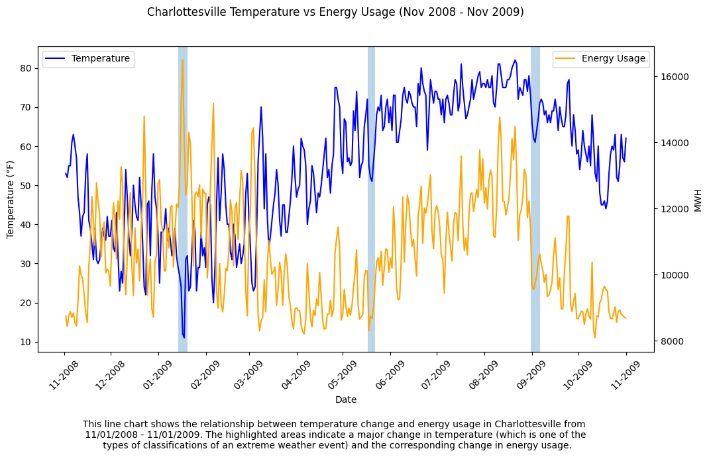

# Let's hope energy can keep up with Mother Nature's big changes

Extreme weather events can be dangerous, especially if energy companies are not prepared for them, and the change in energy demand they can cause. Having machine learning models that can help predict the changed energy demands is beneficial for the companies themselves and their clients 

### Problem Statement

In this project, the specific problem statement is 'How accurately can machine learning models forecast electricity demand during extreme temperature events compared to normal weather conditions in Virginia?' The relationships between extreme weather patterns and demand forecasting accuracy are not always clearly understood, despite the large amount of data collected around them. Focusing on the state of Virginia is beneficial for identifying specific patterns and connections. This project aims to analyze the ability of machine learning models to predict electricity demand during extreme weather events compared to normal weather conditions. Ideally, comparing accuracies between the two will provide insight into how extreme conditions affect demand predictability, and whether prediction models need adjustments to better account for unusual weather patterns. Finding the most accurate model is most beneficial for electricity companies to help prepare themselves for these extreme weather conditions to best serve their clients. 

### Solution Description 

Combining energy usage data from Dominion Energy and weather data from NOAA creates a large, useful dataset to train machine learning models with. Looking at a smaller subset of the data, specifically from Charlottesville, VA from the dates of 11/01/2008 - 11/01/2009, there is already an obvious trend of the changes in energy usage corresponding with the changes in temperature. The line chart below shows the temperature and energy usage data from this timeframe, and highlights some of the bigger, abrupt changes in these parameters as well. These types of extreme weather events - along with others such as heavy rain, snow, high winds, and high or low air pressure - are what could potentially cause extreme changes in energy usage. Machine learning models that can accurately predict energy usage during and after these events is crucial to help these companies function efficiently. 

### Chart 

